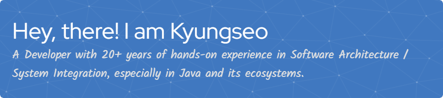

## 👩‍💻 About Me

<i>▶ I'm currently working on a project!</i>

A Developer with 20+ years of hands-on experience in Software Architecture/System Integration/Team Leading, especially in Java and its ecosystems.

### 🛠 My Skill Set  
<table><tr><td valign="top" width="300px">
<b>Frontend</b>  

  
  
  
  
  
    
  
  
  
  

</td><td valign="top" width="300px">
<b>Backend</b>  

  
  
  
  
  <!--
  
  
  -->
    
  Spring Framework, Spring Boot, Spring Security, Spring MVC RESTful API, JPA / MyBatis
    

</td><td valign="top" width="300px">
<b>DevOps</b>  

  
  
  
  
    
  
  
  <!--
  
  -->
  
  

</td></tr></table>

### 📫 Connect with me

   
